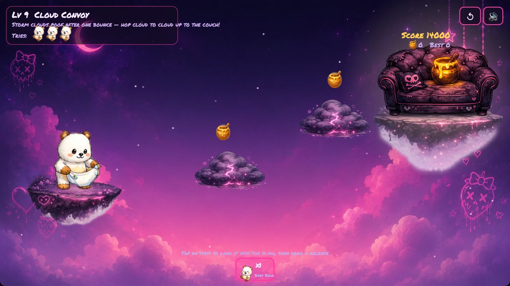

# GoodguyGPT Bear: Diaper Sling Rescue 🧸

A kawaii-goth physics puzzler in a single self-contained HTML file.
Fling Baby Bear from a diaper slingshot across floating islands to the safe honey targets —
**16 levels** of one-use storm clouds, rhythm bounces, skull-spring launches, seesaw catapults,
boulder chain reactions, orbit stars and feather glides.

## How to play
- **Drag & release** the diaper sling to launch Baby Bear — he only lands safely on *soft* things.
- Some levels give you **helper items** (pacifier switches, honey lures, cloud bridges…): fire them first to set up the path.
- Grab **honey pots** mid-flight for bonus points; three stars if you're stylish.

**Play online:** https://da-games-hub.github.io/goodguy/ — or download `index.html` and open it in any browser. No install, no server, everything embedded.

Made with [Claude Code](https://claude.com/claude-code).
